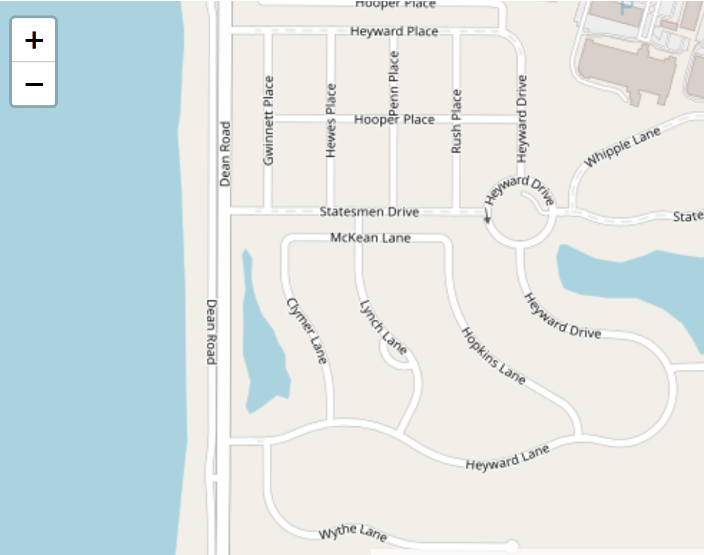
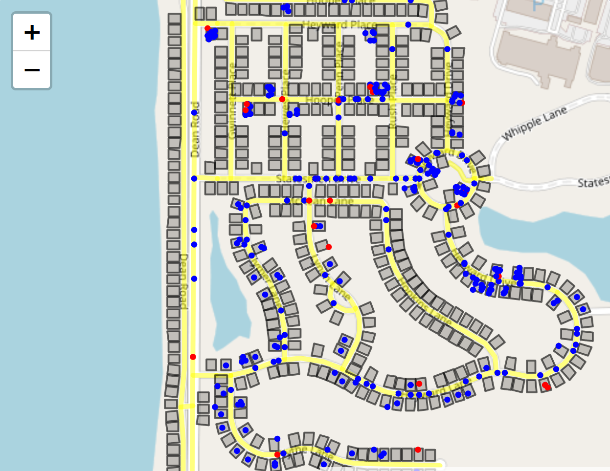

# AgentMaps - Social Simulations on Real World Maps

AgentMaps is a library for building and visualizing agent-based simulations on real world maps.
Agents are arbitrarily programmable at multiple levels of granularity.
They can represent people, vehicles, animals, infectious agents, and more.

AgentMaps lets you turn a map like this:

into a simulation like this:

You can install it via npm (`npm install agentmaps`) and bundle it yourself, or you can get a premade bundle [here](https://unpkg.com/agentmaps@2/site/dist/agentmaps.js) to include directly in a webpage. 
You'll need to [include Leaflet](https://leafletjs.com/download.html) separately.

### Documentation

Docs for people who want to use AgentMaps are available [here](https://noncomputable.github.io/AgentMaps/docs/index.html).

Docs for people who want to understand its internals are [here](https://noncomputable.github.io/AgentMaps/devdocs/index.html).

A basic walkthrough for creating an AgentMaps simulation can be found [here](https://noncomputable.github.io/AgentMaps/docs/tutorial-quickstart.html). 

### Demos

[Simple](https://noncomputable.github.io/AgentMaps/demos/simple/simple.html): Shows all the different ways agents can travel around a map.

[Contagion](https://noncomputable.github.io/AgentMaps/demos/basic_contagion/basic_contagion.html): Agents commute between different parts of a neighborhood while an infection spreads between them.

You can find the corresponding code under _/demos_ in the gh-pages branch [here](https://github.com/noncomputable/AgentMaps/tree/gh-pages/demos).

### Plugins

[IconAgents](https://github.com/noncomputable/AgentMaps-IconAgents): Lets you depict agents with custom icons instead of circles. 

---

Thank you to anyone who somehow benefits from this.

**AgentMaps: Geospatial Agent-based Modeling and Simulation for JavaScript.**
